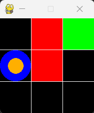
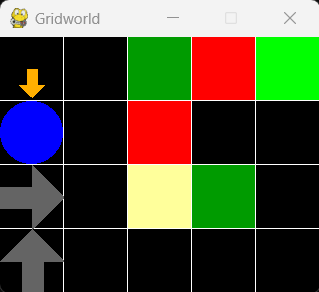
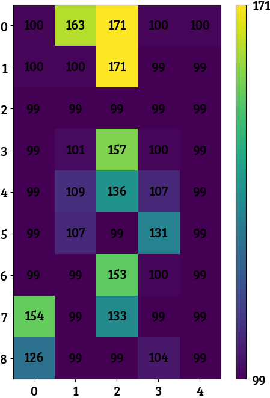
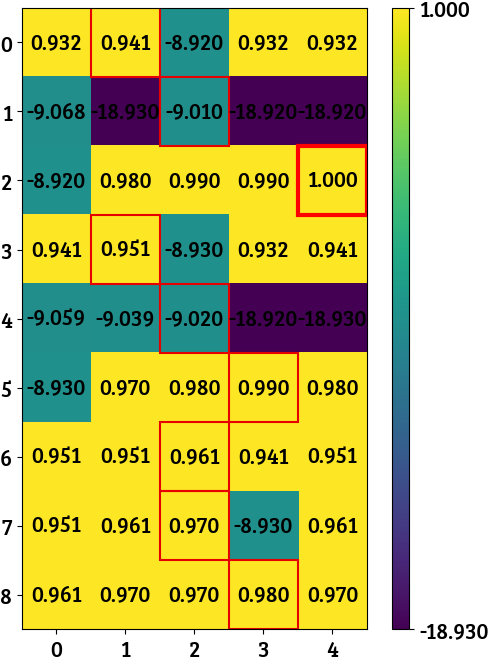
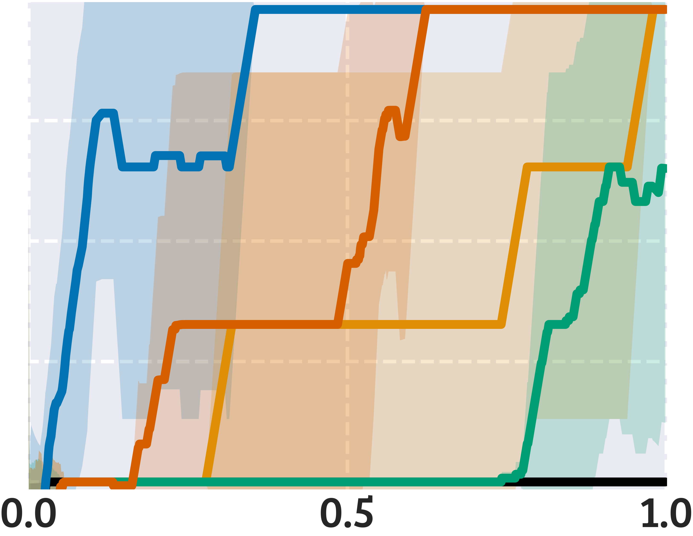
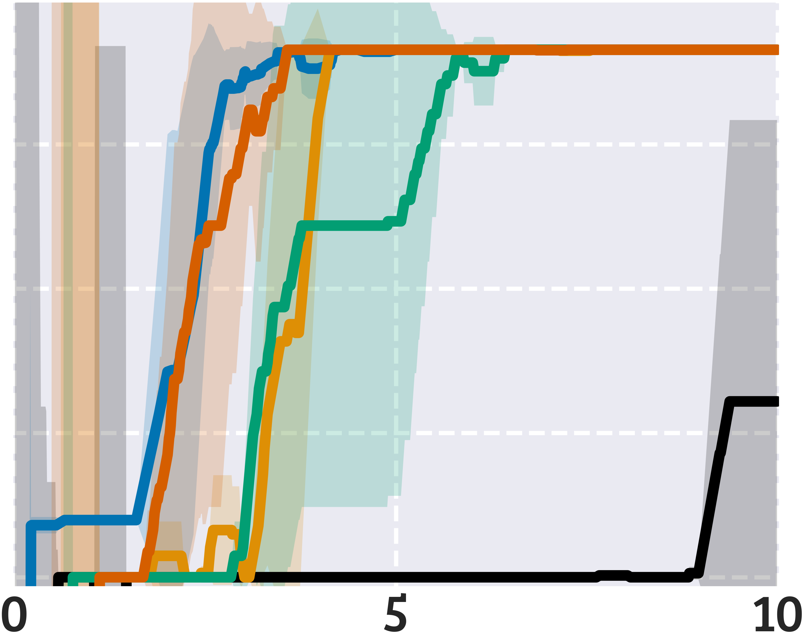

Source code of the paper [Beyond Optimism: Exploration With Partially Observable Rewards](https://arxiv.org/abs/2406.13909).

## Install and Examples

To install and use our environments, run
```
pip install -r requirements.txt
cd src/gym_gridworlds
pip install -e .
```

Run `python` and then
```python
import gymnasium
env = gymnasium.make("Gym-Gridworld/Penalty-3x3-v0", render_mode="human")
env.reset()
env.step(1) # DOWN
env.step(4) # STAY
env.render()
```

to render the `Penalty-3x3-v0` (left figure), and
```python
import gymnasium
env = gymnasium.make("Gym-Gridworld/Full-5x5-v0", render_mode="human")
env.reset()
env.step(1) # DOWN
env.render()
```

to render the `Full-5x5-v0` (right figure).

<p align="center">
   &nbsp;&nbsp;&nbsp;&nbsp;&nbsp;
  
</p>

- Black tiles are empty,
- Black tiles with gray arrows are tiles where the agent can move only in one direction (other actions will fail),
- Red tiles give negative rewards,
- Green tiles give positive rewards (the brighter, the higher),
- Yellow tiles are quicksands, where all actions will fail with 90% probability,
- The agent is the blue circle,
- The orange arrow denotes the agent's last action,
- The orange dot denotes that the agent did not try to move with its last action.

It is also possible to add noise to the transition and the reward functions.
For example, the following environment
```python
import gymnasium
env = gymnasium.make("Gym-Gridworld/Full-5x5-v0", random_action_prob=0.1, reward_noise_std=0.05)
```
- Performs a random action with 10% probability (regardless of what the agent wants to do),
- Adds Gaussian noise with 0.05 standard deviation to the reward.


## Hydra Configs
We use [Hydra](https://hydra.cc/docs/intro/) to configure our experiments.  
Hyperparameters and other settings are defined in YAML files in the `configs/` folder.  
Most of the configuration is self-explanatory. Some keys you may need to change are the following:
- [WandB](https://wandb.ai/site) settings and Hydra log directories in `configs/default.yaml`,
- Folder `experiment.datadir` in `configs/default.yaml` (where `npy` data is saved),
- Folder `experiment.debugdir` in `configs/default.yaml` (where agent pics are saved),
- Learning rate, epsilon decay, Q-function initial values, and other agent parameters are `configs/agent/`,
- Training/testing setup is in `configs/environment/`.


## Quick Run
```
python main.py experiment.debugdir=debug environment=penalty monitor=full
```

This will save pics to easily debug a run.  
Everything will be saved in `debug/`, in subfolders depending on the Git commit and environment name.  
For example, you will find these two heatmaps, representing the state-action visitation count and the
Q-function.
- States are on the y-axis,
- Actions are on the x-axis,
- Cells outlined in red are for the actions with the highest value in each state.

<p align="center">
   &nbsp;&nbsp;&nbsp;&nbsp;&nbsp;
  
</p>

Run the following script to see the optimal Q-function
```
python fqi.py experiment.debugdir=debug environment=penalty monitor=full
```


## Sweeps
For a sweep over multiple jobs in parallel with Joblib, run
```
python main.py -m hydra/launcher=joblib hydra/sweeper=test
```
Custom sweeps are defined in `configs/hydra/sweeper/`.  
You can further customize a sweep via command line. For example,
```
python main.py -m hydra/launcher=joblib hydra/sweeper=test experiment.rng_seed="range(0, 10)" hydra.launcher.verbose=1000
```
Configs in `configs/hydra/sweeper/` hide the training progress bar of the agent, so we
suggest to pass `hydra.launcher.verbose=1000` to show the progress of the sweep.

If you have access to a SLURM-based cluster, you can submit multiple jobs,
each running a chunk of the sweep with Joblib. Refer to `submitit_jobs.py` for an example.


## Plot Data From Sweeps
Experiments will save the expected discounted return of the ε-greedy (training)
and greedy (testing) policies, along with other stats, in a `npz` file
(default dir is `data/`, followed by the hash of the Git commit).  
If you want to zip the whole data folder, run
```
find data -type f -name "*.npz" -print0 | tar -czvf data.tar.gz --null -T -
```

To plot expected return curves, use `plot_results.py`. This script takes two arguments:
- `-c` is the config file that defines where to save plots, axes limits, axes ticks,
  what algorithms to show, and so on. Default configs are located in `configs/plots/`.
- `-f` is the folder where data from the sweep is located.  
A separate script `plot_legend.py` saves the legend in a separate pic.

For example, running
```
python plot_results.py -c configs/plots/test.py -f data_test/GIT_HASH/
python plot_legend.py
```
Will generate many plots like these, and save them in the same folder passed with `-f`.

<p align="center">
   &nbsp;&nbsp;&nbsp;&nbsp;&nbsp;
  
</p>
